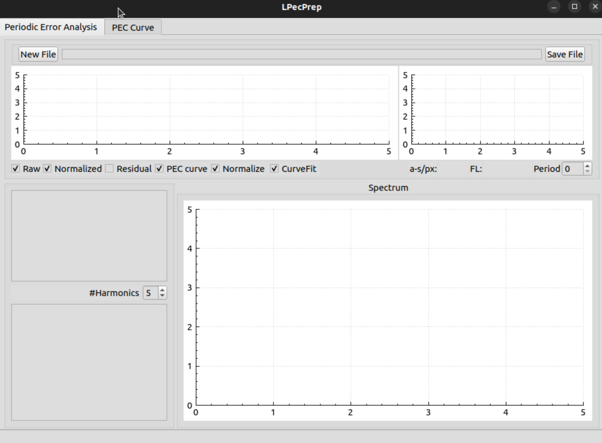
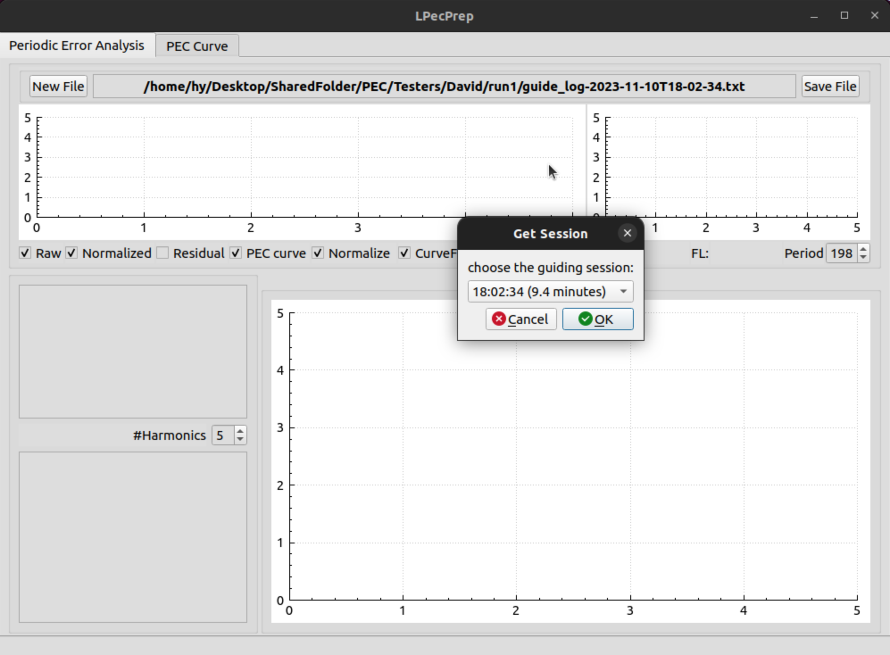
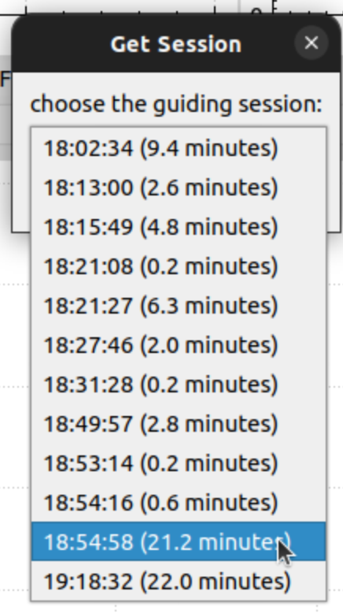

# LPecPrep
## PEC Curve creation for Linux

## Inspired by:
 - [PECPrep](https://eq-mod.sourceforge.net/pecprep/)

## Designed for:
 - KStars [KStars Documentation](https://edu.kde.org/kstars/)
 - Any other Cross Platform Astronomical Program based on C++ and QT

## The History
 
# Compiling the program

## Linux
- Clone this repo into, e.g. ~/Projects/lpecprep
- mkdir ~/Projects/lpecprep-build
- cd  ~/Projects/lpecprep-build
- cmake ../lpecprep
- make -j8 LPecPrep

# What else do I need to install
- Not totally sure at this point, but if you can compile KStars, you can compile this.

# Using the Program

Start it from the command line as follows:
- ~/Projects/lpecprep-build/LPecPrep

Then it starts as follows:

- You then need to add your mount's worm period, in seconds, into the **Period** box on the middle right.
- Then click on **New File** and navigate to a pec-training ekos guider log file and accept that. That file needs to be generated usig experimental KStars/Ekos software. It should come up with a menu of possible guider sessions.

- Click on the one you want and then click OK.

- It then generates a PEC file, and you can save it using the **Save File** button.

- You can look at the PEC curves in the **PEC Curve** tab.

